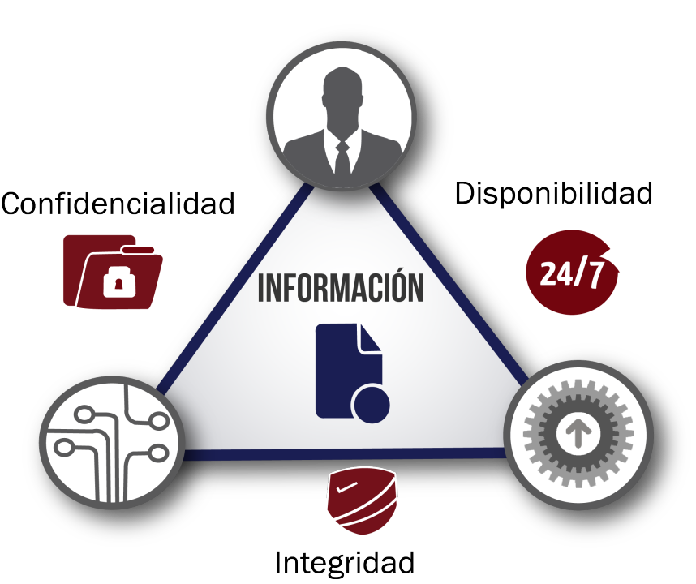

# Unidad 1: Adopción de pautas de seguridad informática

- Dimensiones de la seguridad de la información: confidencialidad, integridad y disponibilidad.
- Elementos vulnerables en el sistema informático: hardware, software y datos.
- Análisis de las principales vulnerabilidades de un sistema informático.
- Ingeniería social y fraude electrónico:
  - Características de la ingeniería social.
  - Características del fraude electrónico y tipos.
  - Buenas prácticas.
  - Denunciar una estafa electrónica.
- Amenazas. Tipos:
  - Amenazas físicas.
  - Amenazas lógicas.
- Seguridad física y ambiental:
  - Ubicación y protección física de los equipos y servidores.
  - Sistemas de alimentación ininterrumpida.
- Seguridad lógica:
  - Criptografía. Tipos de criptosistemas y algoritmos.
  - Cifrado de ficheros y unidades.
  - Codificación.
  - Listas de control de acceso.
  - Establecimiento de políticas de contraseñas seguras.
  - Gestores de contraseñas.
  - Políticas de almacenamiento.
  - Copias de seguridad e imágenes de respaldo.
- Análisis forense en sistemas informáticos:
  - Objetivos del análisis forense.
  - Fases del análisis forense.
  - Recolección, análisis y presentación de las evidencias.

## 1. Dimensiones de la seguridad de la información
> “El único sistema seguro es aquel que está apagado y desconectado, enterrado en un refugio de hormigón, rodeado por gas venenoso y custodiado por guardianes bien pagados y muy bien armados. Aún así, yo no apostaría mi vida por él.” - *Eugene H. Spafford*

Esta frase ilustra de forma irónica la dificultad de alcanzar una seguridad informática absoluta. En la práctica, **no existe el sistema 100% seguro**, por lo que el objetivo realista es lograr **sistemas fiables**, capaces de resistir amenazas, recuperarse ante incidentes y proteger los activos de información.

### Objetivos de un sistema seguro y fiable
Un sistema fiable debe:
- 🔍 Detectar problemas y amenazas antes de que se materialicen.
- 🛠️ Garantizar el uso adecuado de recursos y aplicaciones.
- 🧯 Limitar pérdidas y facilitar la recuperación tras incidentes.
- 📜 Cumplir con el marco legal y las políticas organizativas.

Para alcanzar estos objetivos, la seguridad de la información se fundamenta en tres pilares esenciales, conocidos como la **triada CID** (Confidencialidad, Integridad y Disponibilidad) CIA (Confidentiality, Integrity and Availability). Estos principios son la base de cualquier estrategia de protección de datos y sistemas informáticos.

> 🛡️ En España, el [INCIBE (Instituto Nacional de Ciberseguridad)](https://www.incibe.es/) ofrece recursos, formación y asistencia para mejorar la seguridad de ciudadanos, empresas y centros educativos. Es una referencia clave en la promoción de buenas prácticas y en la respuesta ante incidentes de ciberseguridad.

### 🔐 Confidencialidad
La confidencialidad busca garantizar que la información solo sea accesible por personas autorizadas. Su objetivo es **evitar el acceso no autorizado**, el espionaje, el robo de datos y la divulgación indebida.

Ejemplos y mecanismos:
- **Cifrado de datos**: El sistema EFS (Encrypted File System) en Windows permite cifrar archivos y carpetas en particiones NTFS. Solo el usuario que realiza el cifrado puede acceder al contenido.
- **Autenticación multifactor (MFA)**: Combina algo que el usuario sabe (contraseña), algo que tiene (token o móvil) y algo que es (biometría).
- **Gestores de contraseñas**: Aplicaciones que almacenan credenciales cifradas y ayudan a generar contraseñas seguras.
- **Políticas de acceso**: Control de acceso basado en roles (RBAC), donde cada usuario accede solo a lo necesario.

Buenas prácticas:
- No compartir contraseñas.
- Evitar redes públicas sin cifrado.
- Verificar la identidad de quien solicita información.

### 🧩 Integridad
La integridad asegura que la información no ha sido modificada de forma no autorizada, ya sea de manera maliciosa o accidental. Es esencial para que los datos sean fiables y útiles.

Ejemplos y mecanismos:
- **Hashing**: Algoritmos como SHA-256 permiten verificar que un archivo no ha sido alterado.
- **System File Checker (SFC)** en Windows: Verifica la integridad de los archivos del sistema y los repara si están corruptos.
- **Rootkit Hunter en Linux**: Detecta modificaciones sospechosas en archivos del sistema.
- **Control de versiones**: Herramientas como Git permiten rastrear cambios y restaurar versiones anteriores.

Amenazas comunes:
- **Rootkits**: Malware que sustituye archivos del sistema para ocultarse.
- **Modificaciones accidentales**: Errores humanos que alteran datos críticos.

### 📶 Disponibilidad
La disponibilidad garantiza que los datos y servicios estén accesibles cuando se necesiten, especialmente en entornos críticos como hospitales, empresas o infraestructuras públicas.

Ejemplos y mecanismos:
- **SAI (Sistema de Alimentación Ininterrumpida)**: Dispositivo que mantiene los equipos encendidos durante cortes eléctricos breves.
- **Fuentes de alimentación redundantes**: Permiten que un servidor siga funcionando si una fuente falla.
- **Grupos electrógenos**: Proveen energía en cortes prolongados.
- **Copias de seguridad**: Permiten restaurar sistemas tras fallos o ataques.
- **Monitorización de servicios**: Herramientas como Nmap o Zenmap detectan caídas de servicios y vulnerabilidades.

Amenazas comunes:
- Ataques DoS/DDoS: Saturan los sistemas para impedir el acceso legítimo.
- Fallo de hardware: Puede provocar pérdida de acceso a datos.
- Errores de configuración: Pueden bloquear servicios esenciales.

> Actividad 1.1: COnfidencialidad de los datos en Windows

> Actividad 1.2:

> Actividad 1.3:

